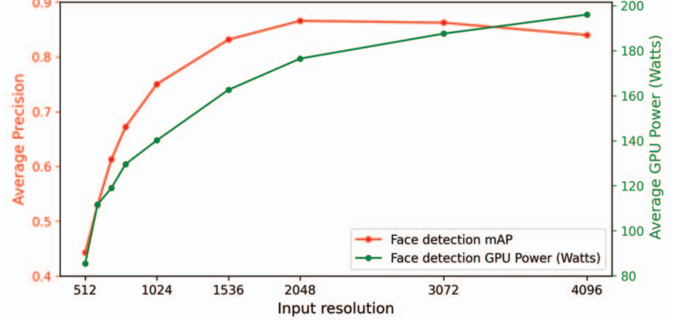

Drone Detection Paper Overview
====

Proposal: 
----
1. SSD/YOLOV8+FPA+certain layer adjustment
2. Lightweight model,ThunderNet,TinyDect,but with poor performance comparing with the above.
*[Paper](https://arxiv.org/pdf/2304.03428.pdf)*
4. If instance segmentation, further research is required          
  

Background:
----
1. CNN structured model cannot easily detect small objects.
2. Model demos are not with high resolution images.
3. High resolution may lead to some waste

4. 

