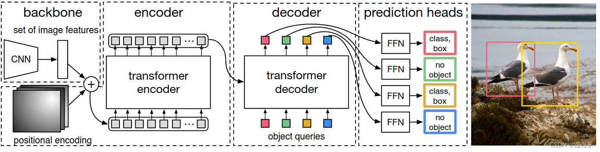

Drone Detection Paper Overview
====

Proposal: 
----
1. SSD/YOLOV8+FPA+certain layer adjustment,one stage or two stages detection
2. Lightweight model,ThunderNet,TinyDect,but with poor performance comparing with the above.
*[Paper](https://arxiv.org/pdf/2304.03428.pdf)*
3. If instance segmentation, further research is required.
4. Transformer as the backbone, and for further potential large model systems.
   + DETR+Swin
   
   + 

  

Background:
----
1. CNN structured model cannot easily detect small objects.
2. Model demos are not with high resolution images.
3. High resolution may lead to some waste

Yolo
----
1. Traditional object, proposals->classification->refine(post-processes)
2. Yolo is a *regression* problem
3. Small objects are with low accuracy and hared to detect.
4. Read whole information from images
5. Improvements possibility: 
   - spatial constraints->dense small objects
   - Small error for small objects with more influence than the bigger

