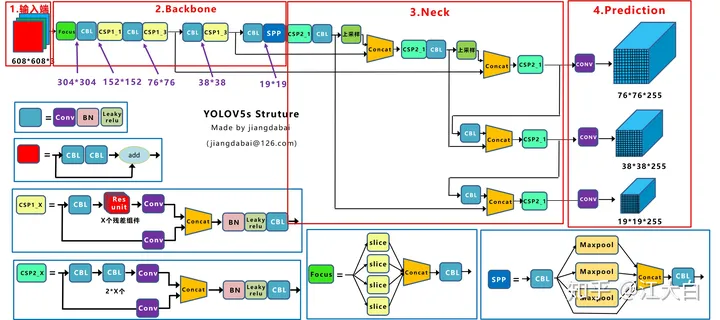
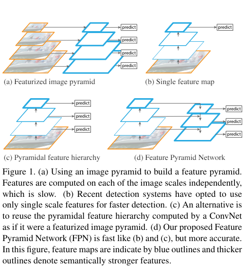

Drone Detection Paper Overview
====

Proposal: 
----
1. SSD/YOLOV8+FPA+certain layer adjustment,one stage or two stages detection
2. Lightweight model,ThunderNet,TinyDect,but with poor performance comparing with the above.
*[Paper](https://arxiv.org/pdf/2304.03428.pdf)*
3. If instance segmentation, further research is required.
4. Transformer as the backbone, and for further potential large model systems.
   + DETR+Swin
   

Background:
----
1. CNN structured model cannot easily detect small objects.
2. Model demos are not with high resolution images.
3. High resolution may lead to some waste

Yolo
====
1. Traditional object, proposals->classification->refine(post-processes)
2. Yolo is a *regression* problem
3. Small objects are with low accuracy and hared to detect.
4. Read whole information from images
5. Improvements possibility: 
   - spatial constraints->dense small objects
   - Small error for small objects with more influence than the bigger

Yolov5
----

1. Focus: Accelerate the downsampling?(Switched by 6*6 Conv in V6)
2. FPN+PAN(Feature Pyramid Network+Pyramid Attention Network)
   + FPN: to detect multi-scal objects; to let high resolution also with strong semantics
   + 
   + PAN: local consistency
3. SPP(Spatial Pyramid Pooling): multi-scales fusion
4. Loss: 
   + CLS:BCE
   + OBJ:CIOU_LOSS between GT and prediction, weighted for balance
   + Location loss: CIOU_LOSS
     + $b_x=\sigma(t_x)+c_x$
     + $b_y=\sigma(t_y)+c_y$
     + $b_w=p_w\cdot e^{t_w}$
     + $b_h=p_h\cdot e^{t_h}$
5. NMS and Grid Sensitivity
Yolov5_v6
----

1. Data Aggregation
2. Focus->6*6 Conv: faster
3. SPPF: parallel to sequential, reduce the parameters
4. CSP->C3: use bottleneck to reduce the parameters
5. SiLu: less computation than Mish and also improve the "dead" problem of ReLu
6. Loss: 
   + CLS:BCE
   + OBJ:CIOU_LOSS between GT and prediction, weighted for balance
   + Location loss: CIOU_LOSS, only positive samples
     + $b_x=(2\cdot\sigma(t_x)-0.5)+c_x$
     + $b_y=(2\cdot\sigma(t_y)-0.5)+c_y$
     + $b_w=p_w\cdot(2\cdot\sigma(t_w))^2$
     + $b_h=p_h\cdot(2\cdot\sigma(t_h))^2$
     + relocate the limits to $(-0.5,1.5)$

Yolov8
----
1. Focal Loss: 
   + CE->BCE->FL
   + $FL(p_t)=-a_t(1-p_t)^\gamma log(p_t)$
   + $a_t$ improves class imbalance, negative and positives examples.
   + Modulating term $(1-p_t)^\gamma$ down-weight the contribution of easy examples during training and rapidly focus the model on hard examples. $\gamma$>0 reduces the relatives loss for well-classified examples.
2. ELAN:
3. Multiple decoupled heads

